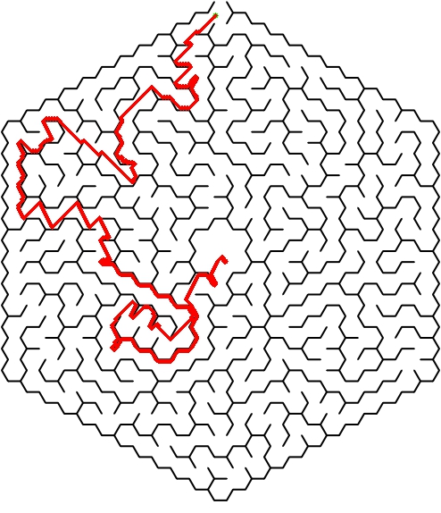

# Robot Path Planning with UI
A little project to run different path planning using a simple UI - Streamlit.

## How to run
```
pip install --upgrade pip
pip install -r requirements.txt
streamlit run ui.py
```

After running streamlit, you should watch in your shell the local/network URL for the project.
Normally it will launch your default browser, if not ctrl + click on any of the links.

## Examples
### Hexagon Maze.


### Hexagon Maze Solved.


## Dijkstra vs A* 
The algorithms are really similar, however A* uses an heuristic function to become more efficient!
